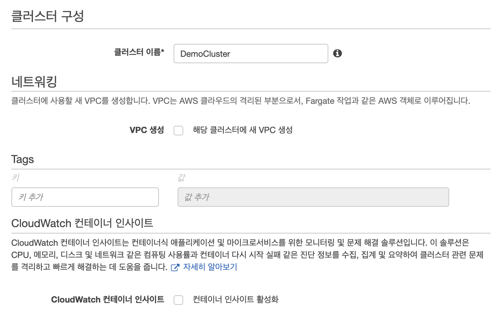

# ECS + Fargate로 무중단 배포하기

- 목차

  - 무중단 배포란?
  - ECS(Elastic Container Service) 기초
  - Fargate 기초
  - ECS 설정하기
  - Github Action으로 배포해보기

## 무중단 배포란?

- 무중단 배포란 **서버의 다운타임이 없는 배포 환경**을 의미합니다.  
  매우 간단하게, 하나의 서버에 일반적인 배포 프로세스를 살펴봅시다.

  - (1) 기존의 코드가 실행 중입니다.
  - (2) 새로운 코드가 저장소에 올라갑니다.
  - (3) 새로운 코드를 실행할 수 있도록 빌드합니다.
  - (4) 기존에 실행 중이던 코드의 프로세스를 중단합니다.
  - (5) `(3)`번 단계에서 빌드된 코드를 실행시킵니다.

- 위 순서대로 이루어지는 배포의 경우, 새로운 코드를 실행시켜야 할 때 문제가 발생합니다.  
  예를 들어, `(4)`, `(5)`번 과정 사이에 클라이언트가 요청을 보내면 어떻게 될까요?  
  서버가 아직 실행 중인 코드가 없기 때문에 **요청을 정상적으로 처리하지 못합니다.**

- 이를 해결하기 위해 생긴 배포 프로세스가 **무중단 배포** 입니다.  
  무중단 배포에는 여러 가지 방법이 있지만 공통된 개념은 아래와 같습니다.

> 새로운 코드가 생겼을 때 기존 코드를 중단하고 새로운 코드를 실행하는데에 다운타임(down time)을 없앤다.

- 여러 가지 오픈소스(ex. Kubernetes)들로 무중단 배포 프로세스를 구축할 수 있지만,  
  여기서는 AWS가 제공하는 ECS, Fargate라는 서비스로 무중단 배포를 구축해보겠습니다.

<hr/>

## ECS(Elastic Container Service) 기초

- ECS는 AWS에서 제공하는 Managed Container Orchestration Service로, 컨테이너를 기반으로  
  서비스를 배포, 운영 및 관리하는 등의 기능을 제공해주는 서비스 입니다.

- ECS를 사용하기 전에 필수적으로 알아둬야 할 용어들이 몇 가지 있습니다.  
  생소할 수도 있지만, 꼭 알아둬야 하기 때문에 하나씩 보도록 하겠습니다.

### 클러스터(Cluster)

- Cluster는 **ECS의 가장 기본적인 단위** 입니다.  
  Cluster는 논리적인 개념으로, 서비스나 태스크가 실행되는 공간입니다.  
  따라서 Cluster가 없으면, 즉 ECS의 가장 기본적인 단위가 없으면  
  ECS에서 Container를 실행할 수 없습니다.

### 컨테이너 인스턴스(Container Instance)

- 컨테이너 인스턴스는 클러스터에서 서비스 또는 태스크를 실행하기 위해 사용되는 컴퓨팅 자원입니다.  
  클러스터 스케쥴러는 클러스터 인스턴스를 조작할 수 있는 권한을 가지며, 클러스터에서 서비스 또는 태스크를  
  실행하면 조건을 만족하는 컨테이너 인스턴스를 찾아 컨테이너로 실행합니다.  
  **단, Fargate를 사용하면 컨테이너 인스턴스 없이 컨테이너를 실행할 수 있습니다.**

### 이미지(Image)

- ECS는 Container Orchestration의 도구로, 컨테이너를 관리합니다.  
  이때 컨테이너는 이미지로부터 실행되며, 이미지는 특정 애플리케이션을 실행 가능한 환경을  
  재현하기 위한 파일들의 집합입니다. 이 이미지는 ECS와는 별개로 생성 및 관리됩니다.  
  따라서 **ECS를 사용하려면 먼저 실행시키고자 하는 애플리케이션을 Image로 가지고 있어야 합니다.**  
  일반적으로 이미지는 Dockerfile을 통해 관리되며, Docker Hub 또는 ECR에 업로드해서 사용합니다.

### 작업 정의(Task Definition)

- Task Definition은 ECS의 최소 실행 단위인 Task(작업)를 실행하기 위한 설정 정보를 담고 있는 리소스입니다.  
  Task Definition은 하나 또는 두 개 이상의 컨테이너에 대한 정보를 포함할 수 있습니다.  
  컨테이너별로 실행하고자 하는 이미지를 지정해야 하며, CPU, RAM 등 리소스 제한 정보와  
  컨테이너의 실행에 필요한 옵션들을 지정할 수 있습니다.

### 작업(Task)

- Task는 ECS의 최소 실행 단위로, 하나 또는 두 개 이상의 컨테이너의 묶음입니다.  
  Task는 독립 실행되거나 서비스에 의해 실행될 수 있습니다.  
  Cluster는 적절한 컨테이너 인스턴스를 찾아서 Task Definition을 기반으로 Task를 실행합니다.  
  독립적으로 실행된 Task는 한 번 실행된 이후로는 관리되지 않습니다.

### 서비스(Service)

- Service는 Task를 지속적으로 관리하는 단위입니다.  
  Service는 클러스터 내에서 Task가 지정된 수 만큼 지속적으로 실행될 수 있도록 관리합니다.  
  또한 AWS의 Load Balancer와 연동해서 실행중인 Task를 찾아 자동적으로 Load Balancer에  
  등록 또는 제거하는 역할도 담당합니다.

<hr/>

## Fargate 기초

- AWS Fargate는 AWS RE:INVENT 2017에서 소개된 서비스로, AWS ECS를 기반으로 작동합니다.  
  이 서비스는 하나의 Docker Image를 실행시킬 수 있는 컨테이너 입니다.

- 이전에는 EC2와 같은 클라우드 컴퓨팅 자원을 활용하여 서버를 구축하고, 그 서버에 Docker를 설치하고,  
  Dockerfile을 통해 Docker Image를 만들고 그 Image를 실행시켰습니다.

- 하지만 Fargate가 등장하면서, 단순히 **Docker Image를 만들고 그 Image를 Fargate에서 간단히 실행**하기만 하면  
  Docker 이미지 배포를 끝낼 수 있게 되었습니다.

> Fargate는 EC2, RDS 등 다른 서비스들과 다르게 Free Tier가 없습니다.  
> 그리고 여타 IaaS와 마찬가지로 Fargate를 사용하면 관리 포인트가 줄어드니  
> 요금이 꽤 많이 나옵니다...ㅜ

<hr/>

## ECS 설정하기

### ECS 설정 0 - 대상 그룹(Target Group), ALB 생성하기

- ECS는 Container Orchestration Service이기 때문에 컨테이너의 상황별로 컨테이너를 복제하여  
  동일한 컨테이너를 여러 개 수행하는 Scale-Out, 여러 개의 컨테이너 개수를 줄이는 Scale-In 기능을 제공합니다.

- 이를 위해서는 모든 네트워크 트래픽이 ELB를 통해 진행되어야 합니다.  
  ELB(Elastic Load Balancer)는 요청을 받아서 적절한 컨테이너를 찾아 부하 분산을 담당합니다.  
  아래 그림을 보면 이해가 될 것 같습니다.


- ELB를 생성하기에 앞서, 추후에 만들 ELB가 어떤 인스턴스에 대한 로드 밸런싱을 수행할지를 지정해주는  
  **대상 그룹(Target Group)** 을 생성해야 합니다. EC2 콘솔의 왼쪽 하단에 `대상 그룹`을 선택하여 이동합니다.  
  설정한 정보는 아래와 같습니다.


- 하위에는 `Health Checks` 부분이 있는데, 여기에 API Endpoint를 지정하면 ALB가 주기적으로 요청을 보내  
  이 대상 그룹의 인스턴스가 잘 동작하고 있는지를 확인합니다.

- 이제 ELB를 생성하기 위해 다시 EC2 콘솔로 가서, 왼쪽 하위에 있는 `로드 밸런서`를 클릭하여 이동합니다.  
  4개의 Load Balancer 종류 중, **Application Load Balancer** 를 선택하고, 넘어갑니다.

- 아래와 같이 설정을 진행해줍니다.


- `Scheme` 설정에서, 이 예시에서는 Private VPC 내부를 위한 ALB가 아니므로 `Internet-Facing`을 선택합니다.  
  아래 부분에는 네트워크 설정, 보안 그룹 지정 및 대상 그룹을 지정하는 부분이 있는데, 네트워크 및 보안 그룹은  
  각자의 상황에 맞게끔 지정하고, 대상 그룹은 방금 만든 `DemoTargetGroup`을 지정해줍니다.

- 설정 후 요약 정보를 보면 아래와 같습니다.


- 마지막으로 하나만 더 해줘야 하는데, 바로 ECR을 만들어야 합니다.  
  ECR은 우리가 빌드한 Docker Image가 저장되는 저장소 입니다.

- ECS 콘솔로 이동하여 왼쪽 탭에 `ECR`을 클릭한 후, 아래와 같이 만들어줍니다.


### ECS 설정 1 - 작업 정의(Task Definition)

- 이제 ECS를 설정하기 위한 사전 작업은 모두 끝났습니다.  
  ~~사전 작업만 해도 너무 많다...~~

- ECS를 설정하기 위해 처음으로 해줘야 할 것은 **작업 정의** 입니다.  
  마찬가지로 ECS 콘솔의 왼쪽 탭에 있는 `작업 정의`를 클릭하여 새로운 작업을 생성합니다.  
  `단계 1`에서는 FARGATE를 선택해줍니다.


- 이제 세부적인 작업 정의를 할 수 있는데, 한 가지 주의점은 **태스트 역할**입니다.  
  여기에는 AWS가 기본적으로 제공하는 IAM 역할인 `ecsTaskExecutionRole`를 지정합니다.  
  기타 설정(작업 크기, 서비스 통합) 등은 원하는대로 설정해줍니다.

- 하단에 보면 `컨테이너 정의` -> `컨테이너 생성` 칸이 있습니다.  
  여기에는 실제로 ECS가 관리할 Container에 대한 정보를 입력해줍니다.


- `이미지` 속성에는 일전에 만든 ECR의 주소 뒤에 `:latest`를 붙여줍니다.  
  이미지의 버전 관리를 할 수 있지만, 여기서는 버전관리까지는 다루지 않기 때문에  
  무조건 최신 이미지를 사용하라는 뜻으로 `:latest`를 붙여주었습니다.

### ECS 설정 2 - 클러스터(Cluster)

- 이제 ECS의 클러스터(서비스 또는 태스크가 실행되는 공간)를 설정해야 합니다.  
  ECS 콘솔의 왼쪽 탭에서 `클러스터`를 선택하여 생성합니다.

- 우리는 Fargate를 사용할 것이기에 1단계(클러스터 템플릿 선택)에서는 **네트워킹 전용** 을 선택합니다.


- 다음 2단계에서는 원하는 설정값을 지정한 후 생성 완료 합니다.



### ECS 설정 3 - 서비스(Service)

- 위에서 봤듯이, 서비스는 작업(Task)을 지속적으로 관리하는 단위입니다.  
  바로 위에서 생성한 클러스터를 클릭하여 `서비스 생성` 버튼을 클릭하여 생성합니다.

#### 1단계: 서비스 구성

- `서비스 구성` 단계에서는 알맞은 서비스 구성을 지정합니다.  
  Fargate를 사용하기에 시작 유형에는 FARGATE, 작업 정의는 위에서 생성했던 작업 정의인  
  `DemoTask`를 선택합니다.

- 작업 개수는 컨테이너 작업이 **안정 상태(Steady State)** 에 도달했을 때 실행시킬 컨테이너의 개수 입니다.  
  만약 안정 상태에 도달했을 때 동일한 컨테이너가 2개 실행되길 원한다면, 2를 입력합니다.

- 다음에는 `배포`가 있습니다. 여기서 배포를 어떤 식으로 진행할지 선택할 수 있습니다.  
  `배포 유형`에는 롤링 업데이트, 블루 그린 배포가 있는데 우리는 **블루 그린 배포**를 선택합니다.  
  `배포 구성`에는 배포 방식을 지정할 수 있습니다. 아래 사진과 같이 여러 방식이 있는데, 여기서는  
  `CodeDeployDefault.ECSAllAtOnce`를 선택합니다. 이 방식은 **기존의 모든 트래픽을 새로 실행된 컨테이너로 전환** 합니다.  
  예를 들어, `CodeDeployDefault.ECSCanary10Percent15Minutes` 같은 경우, 까나리아 배포 방식으로  
  15분마다 10%씩 트래픽을 새로 실행된 컨테이너로 라우팅합니다.

#### 2단계: 네트워크 구성

- `VPC 및 보안 그룹`, `상태 검사 유예 기간`에는 아래와 같이 알맞은 값을 지정해줍니다.


- `로드 밸런싱`이 중요한데, 앞서 만든 ALB에 서비스를 연결해줘야 합니다.  
  우선 `로드밸런서 유형`에는 `Application Load Balancer`를 선택해주고, 앞서 만든 DemoALB를 선택해줍니다.

- `로드 밸런싱할 컨테이너`의 하위에 있는 `Additional Configuration` 또한 매우 중요한 부분인데,  
  Blue/Green 배포를 사용하면 동시에 2개의 컨테이너가(신, 구 버전) 실행되고 있을 수 있으므로 두 개의  
  대상 그룹을 지정해줘야 합니다. 아래처럼 하나씩 만들어서 지정해줍니다.


#### 3단계: 오토 스케일링

- 이 단계에서는 원하는 조건에 컨테이너 개수를 늘리거나(Scale Out), 줄이는(Scale In) 정책을 지정할 수 있습니다.  
  여기서는 별도의 설정을 해주지 않겠습니다.

- 이제 마지막으로 넘어가서 `서비스 생성`을 누르면 모든 작업이 끝납니다.

<hr/>

## Github Action으로 배포해보기

- 여러 가지 CI/CD 툴 중에서, Github Action을 통해 배포를 해보겠습니다.  
  이 배포 과정을 사용하면, 아래와 같은 파이프라인을 구축할 수 있게 됩니다.


- 여기서 만들어볼 CI/CD 파이프라인의 작동 순서는 아래와 같습니다.

  - (1) 특정 branch의 코드가 바뀌면, Github Action이 작동한다.
  - (2) Github Action은 소스 코드를 Docker Image로 빌드한다.
  - (3) 빌드된 Docker Image를 ECS로 push한다.
  - (4) ECS 작업 정의에 push된 새로운 버전의 Docker Image를 적용시킨다.
  - (5) CodeDeploy로 Blue/Green 배포를 수행한다.

### Github Action 작업 파일 만들기

- Github action이 수행할 작업들을 정의한 파일을 만들어보겠습니다.  
  참고로 이 파일은 <a href="https://github.com/actions/starter-workflows/blob/5760418d4f378a531680d729f4bf0b73eea45822/ci/aws.yml">여기</a>에서 템플릿을 제공해줍니다.

```yml
on:
  push:
    branches: [dev]

name: Deploy to Amazon ECS

jobs:
  deploy:
    name: Deploy
    runs-on: ubuntu-latest

    steps:
      - name: Checkout
        uses: actions/checkout@v2

      - name: Configure AWS credentials
        uses: aws-actions/configure-aws-credentials@v1
        with:
          aws-access-key-id: ${{ secrets.AWS_ACCESS_KEY_ID }}
          aws-secret-access-key: ${{ secrets.AWS_SECRET_ACCESS_KEY }}
          aws-region: ${{ secrets.AWS_S3_REGION }}

      - name: build
        run: ./gradlew build

      - name: Login to Amazon ECR
        id: login-ecr
        uses: aws-actions/amazon-ecr-login@v1

      - name: Build, tag, and push image to Amazon ECR
        id: build-image
        env:
          ECR_REGISTRY: ${{ secrets.AWS_ECR_REPOSITORY }}
          ECR_REPOSITORY: demo
          IMAGE_TAG: latest
        run: |
          docker build -t $ECR_REGISTRY/$ECR_REPOSITORY:$IMAGE_TAG .
          docker push $ECR_REGISTRY/$ECR_REPOSITORY:$IMAGE_TAG
          echo "::set-output name=image::$ECR_REGISTRY/$ECR_REPOSITORY:$IMAGE_TAG"
      - name: Fill in the new image ID in the Amazon ECS task definition
        id: task-def
        uses: aws-actions/amazon-ecs-render-task-definition@v1
        with:
          task-definition: task-definition.json
          container-name: DemoContainer
          image: ${{ steps.build-image.outputs.image }}

      - name: Deploy Amazon ECS task definition
        uses: aws-actions/amazon-ecs-deploy-task-definition@v1
        with:
          task-definition: ${{ steps.task-def.outputs.task-definition }}
          service: DemoService
          cluster: DemoCluster
          codedeploy-deployment-group: AppECS-DemoCluster-DemoService
          codedeploy-appspec: appspec.yaml
          wait-for-service-stability: true
```

- 위 파일은 2개의 외부 파일을 참조하는데, `task-definition.json`과 `appspec.yaml`을 참조합니다.

- 여러 개의 Github Secret이 사용된 것을 볼 수 있는데, 그 중 배포 역할을 하는 IAM의  
  역할은 아래와 같습니다.

  - `AmazonEC2ContainerRegistryFullAccess`
  - `AWSCodeDeployRoleForECS`
  - `AmazonEC2ContainerServiceAutoscaleRole`
  - `AmazonEC2RoleForAWSCodeDeployLimited`
  - `AmazonECS_FullAccess`
  - `AmazonS3FullAccess`
  - `AWSCodeDeployFullAccess`

> 실무에서는 절대 Full Access 를 주면 안됩니다!!

- 마지막으로 `codedeploy-deployment-group`에는 ECS 작업 정의할 때 만들어진 CodeDeploy 애플리케이션의  
  **애플리케이션명이 아닌 배포 그룹명** 을 입력해 줍니다.(`DgpECS-~~-~~` 형식)

### task-definition.json

- `task-definition.json` 파일은 작업 정의에 대한 설정값들을 담고 있는 파일입니다.  
  아래처럼 작성해 봅니다.

```json
{
  "executionRoleArn": "작업 정의에서 지정한 작업 실행 IAM의 ARN",
  "containerDefinitions": [
    {
      "name": "DemoContainer",
      "image": "빌드된 Docker Image 값, Github Action이 자동으로 채워주기에 아무 값이나 넣어줘도 된다.",
      "essential": true,
      "portMappings": [
        {
          "hostPort": "컨테이너의 호스트 포트 값, int 형",
          "protocol": "tcp",
          "containerPort": "컨테이너 포트 값, int 형"
        }
      ]
    }
  ],
  "requiresCompatibilities": ["FARGATE"],
  "networkMode": "VPC 값",
  "cpu": "512",
  "memory": "1024",
  "family": "작업 정의에서 생성한 작업명"
}
```

- Github Action은 위 파일의 작업 정의들을 참조하여 ECS 설정을 확인하며, 새로운 작업을 정의하게 됩니다.

### appspec.yaml

```yaml
version: 0.0
Resources:
  - TargetService:
      Type: AWS::ECS::Service
      Properties:
        TaskDefinition: "작업 정의 명(이 값도 Github Action이 자동으로 채워준다.)"
        LoadBalancerInfo:
          ContainerName: "작업 정의에서 지정한 컨테이너명"
          ContainerPort: "컨테이너 포트, int 형"
        PlatformVersion: "LATEST"
```

- Github Action의 수행 과정에서 CodeDeploy가 있는데, CodeDeploy는 위 파일을 참조하여 배포 설정을 합니다.

### 배포 결과 보기

- 배포 과정은 CodeDeploy에서 확인할 수 있습니다.  
  CodeDeploy 콘솔에 가서 우리가 방금 생성한 애플리케이션의 배포 과정을 볼 수 있습니다.  
  배포가 성공적으로 끝난 후의 화면은 아래와 같습니다.


- 또한 아래 사진처럼 1시간을 대기하고 있는 모습을 볼 수 있습니다.


- 1시간을 대기하는 이유는 1시간 동안 새로운 코드를 배포하고, 만약 에러가 발생한다면 롤백하기 위함입니다.  
  오른쪽 위의 `원래 작업 세트 종료`를 하면 모든 배포가 끝납니다.


- 위 결과를 테스트해보기 위해서는 지금은 별도의 라우팅 설정이 되어 있지 않기 때문에 ALB의 주소로 요청을 보내보면 됩니다.


<hr/>
